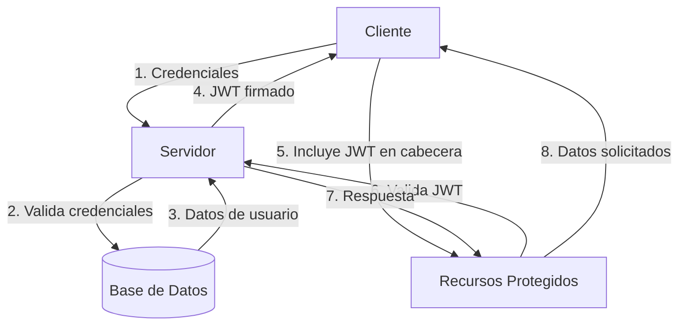

# Autenticación y Autorización

## Visión General

El sistema utiliza JSON Web Tokens (JWT) para la autenticación de usuarios. Los tokens JWT son firmados digitalmente y contienen toda la información necesaria para autenticar y autorizar las solicitudes.

## Flujo de Autenticación



## Estructura del Token JWT

```json
{
  "sub": "usuario123",
  "name": "Nombre Usuario",
  "role": "USER",
  "iat": 1516239022,
  "exp": 1516242622
}
```

### Campos del Token

- `sub`: Identificador único del usuario (subject)
- `name`: Nombre completo del usuario
- `role`: Rol del usuario (ADMIN, ORGANIZER, USER)
- `iat`: Fecha de emisión (issued at)
- `exp`: Fecha de expiración (expiration time)

## Endpoints de Autenticación

### Inicio de Sesión

```http
POST /auth/login
Content-Type: application/json

{
  "username": "usuario123",
  "password": "contraseñaSegura123"
}
```

**Respuesta Exitosa (200 OK)**
```json
{
  "token": "eyJhbGciOiJIUzI1NiIsInR5cCI6IkpXVCJ9...",
  "expiresIn": 3600
}
```

**Error de Autenticación (401 Unauthorized)**
```
Invalid credentials
```

### Registro de Usuario

```http
POST /auth/signup
Content-Type: application/json

{
  "username": "usuario123",
  "password": "contraseñaSegura123",
  "email": "usuario@ejemplo.com"
}
```

**Respuesta Exitosa (200 OK)**
```json
{
  "token": "eyJhbGciOiJIUzI1NiIsInR5cCI6IkpXVCJ9...",
  "expiresIn": 3600
}
```

**Errores (400 Bad Request)**
- Email ya registrado
- Datos de entrada inválidos

## Seguridad

- **Tokens JWT** con expiración configurable (por defecto 1 hora)
- **HTTPS** para todas las comunicaciones
- **Almacenamiento seguro** de contraseñas usando bcrypt
- **Protección contra fuerza bruta** implementada
- **Validación de entrada** en todos los endpoints

## Autorización

Los roles definidos son:

- `ADMIN`: Acceso total al sistema
- `SELLER`: Puede vender entradas
- `USER`: Usuario estándar

## Implementación Técnica

- **Librería JWT**: `io.jsonwebtoken:jjwt` (versión 0.11.5)
- **Algoritmo de Firma**: HS512
- **Clave Secreta**: Configurable mediante variables de entorno
- **Refresh Tokens**: Implementados para renovación de sesión
- **Inyección de Dependencias**: Google Guice
- **Manejo de Excepciones**: Personalizado para respuestas consistentes

## Estructura de Claves

### UserSignupRequest
```java
public record UserSignupRequest(
    String username,
    String password,
    String email
) {}
```

### UserLoginRequest
```java
public record UserLoginRequest (
    String username,
    String password
) {}
```

### LoginResponse
```java
public class LoginResponse {
    private String token;
    private long expiresIn;
    // getters y setters
}
```

## Consideraciones de Rendimiento

- Validación de tokens sin necesidad de consultar la base de datos
- Cache de tokens revocados (para logout)
- Tiempo de expiración balanceado entre seguridad y usabilidad
